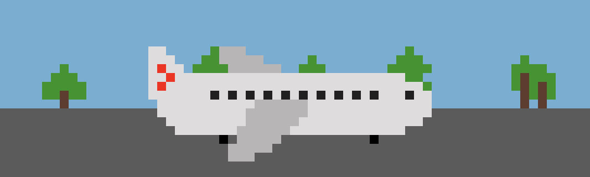

# Safety Instructions

## [Play Online](https://pippinbarr.com/safety-instructions/) (desktop, flash emulation with [ruffle](https://ruffle.rs))

## Description

*Mavis Beacon Teaches Horrible Death In An Air Wreck! See if your fingers are fast enough to save yourself from the many grisly deaths available in the world of air travel. And learn something in the process! Like typing! And how to not die!*

*Safety Instructions* was written in ActionScript 3 using Adobe's FlashBuilder 4.5 and the excellent [Flixel](http://www.flixel.org/) library. It uses sound effects I made in [bfxr](http://www.bfxr.net/) and a soundtrack made with [WolframTones](http://tones.wolfram.com/). The font in Safety Instructions is [Silkscreen](http://www.allfreefonts.com/font-8878-silkscreen.html) by [Jason Kottke](http://kottke.org/). The game is now being presented in emulation thanks to [ruffle](https://ruffle.rs).

## Press

* ~~[IndieGames.com](http://indiegames.com/2011/08/browser_game_pick_safety_instr.html)~~
* [Free Game Planet](https://www.freegameplanet.com/safety-instructions-browser-game/)
* [Gamers with Jobs](http://www.gamerswithjobs.com/node/109592)
* Played on YouTube by [lordJolteon](http://www.youtube.com/watch?v=J4OLTNPP7dM)
* Played on YouTube by [azuritereaction](http://www.youtube.com/watch?v=4VnBItdAlwE)

## Exhibitions

* *Art & the Viewser* at the [Allegheny College art gallery](http://sites.allegheny.edu/art/art-galleries/)
* [The Aesthetics of Gameplay](http://gameartshow.siggraph.org/gas/) by the [SIGGRAPH Digital Arts Community](http://siggrapharts.ning.com/) (online)
* Solo show at [Andrew Baker Gallery](http://www.andrew-baker.com/pb.html), also titled *Safety Instructions*.

## Documentation

* Read the [Process documentation](../process)
* Look at the [code repository](https://github.com/pippinbarr/safety-instructions) for source code etc.

## Links

* [The original .swf file](https://github.com/pippinbarr/safety-instructions/releases/tag/swf)

## License

*Safety Instructions* is an open source game licensed under a [Creative Commons Attribution-NonCommercial 3.0 Unported License](http://creativecommons.org/licenses/by-nc/3.0/). You can obtain the source code from its [code repository](https://github.com/pippinbarr/safety-instructions).
